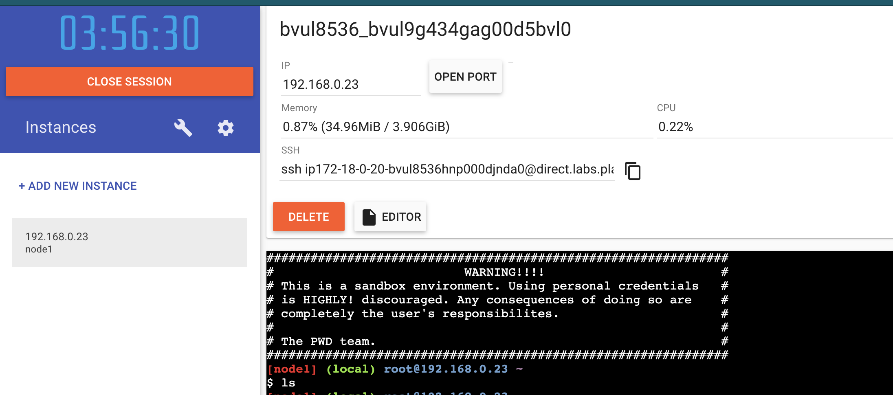
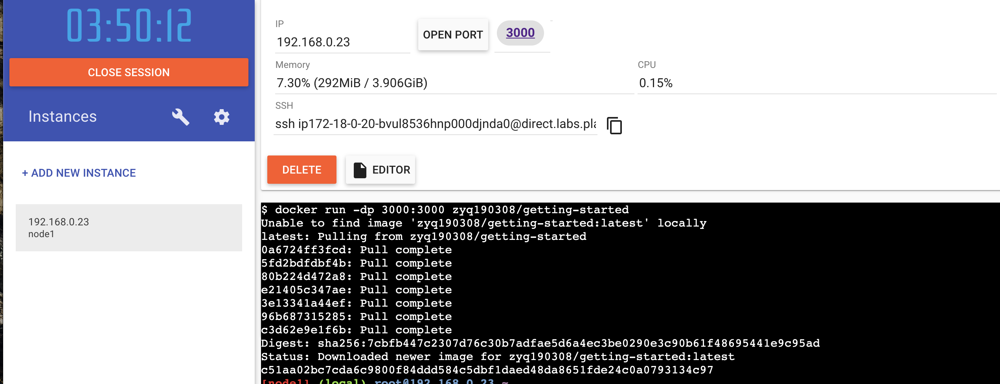

# docker 学习记录

## 开始
从这段docker命令开始：
```bash
docker run -d -p 80:80 docker/getting-started
```

- <code>-d</code> - 在后台运行容器
- <code>-p 80:80</code> - 把主机的80端口映射到容器的80端口
- <code>docker/getting-started</code> - 使用的镜像

可以组合单个字符标志来缩短完整命令。例如，上面的命令可以写为：
```bash
docker run -dp 80:80 docker/getting-started
```

## 什么是容器

简而言之，容器只是您计算机上的另一个进程，已与主机上的所有其他进程隔离。这种隔离利用了Linux上已有很长时间的<code> kernel namespaces and cgroups</code>。 Docker致力于使这些功能更易于使用。

## 什么是容器镜像

运行容器时，它使用隔离的文件系统。此自定义文件系统由容器镜像提供。由于镜像包含容器的文件系统，因此它必须包含运行应用程序所需的所有内容-所有依赖项，配置，脚本，二进制文件等。镜像还包含容器的其他配置，例如环境变量，要运行的默认命令以及其他元数据。

## 构建应用镜像

为了构建应用程序，我们需要使用Dockerfile。 Dockerfile只是基于文本的指令脚本，用于创建容器镜像。如果您以前创建过Dockerfile，则可能会在下面的Dockerfile中看到一些缺陷。但是，不用担心！我们将跳过它们。
1. 在项目根路径下创建一个名为Dockerfile的文件。
```bash
FROM node:12-alpine
WORKDIR /app
COPY . .
RUN yarn install --production
CMD ["node", "src/index.js"]
```

2. 现在使用docker build命令构建容器映像。

```bash
docker build -t getting-started .
```
-t标志标记我们的图像。可以简单地将其视为最终图像的易于理解的名称。由于我们将镜像命名为getting-started，因此我们可以在运行容器时引用该镜像。docker build命令末尾的<code>.</code>告诉Docker应该在当前目录中查找Dockerfile。


## 启动一个容器

1. 使用<code>docker run</code>命令启动容器，并指定我们刚刚创建的镜像的名称：

```
docker run -dp 3000:3000 getting-started
```

2. 打开Web浏览器到http://localhost：3000，此时我们APP就启动了！


## 更新应用
更新代码后，然后重新打包镜像：
```bash
docker build -t getting-started .
```

重新启动容器：
```bash
docker run -dp 3000:3000 getting-started
```

然后就会出现这个错误：
```
docker: Error response from daemon: driver failed programming external connectivity on endpoint silly_thompson (4d33de77d79245a22c03fb1776154b6fa7eea6218c3111698ac59850d0f80776): Bind for 0.0.0.0:3000 failed: port is already allocated.
```
我们不能启动新容器，因为我们旧的容器还在运行，端口还被占用着。要修复这个问题，必须先移除旧容器。

## 移除旧容器
为了移除旧容器，首先得让它停止。有两种移除旧容器的方法。

1. 使用<code>docker ps</code>命令获取容器的ID。

```bash
docker ps
```

2. 使用<code>docker stop</code>命令停止容器。

```bash
docker stop <the-container-id>
```

3. 容器停止后，您可以使用<code>docker rm</code>命令将其删除。

```bash
docker rm <the-container-id>
```

> 您可以通过在docker rm命令中添加“ force”标志来在单个命令中停止和删除容器。例如：docker rm -f <容器标识符>


## 分享你的应用


### 创建一个仓库

1. Go to Docker Hub and log in if you need to.

2. Click the Create Repository button.

3. For the repo name, use getting-started. Make sure the Visibility is Public.

4. Click the Create button!

```bash
docker push zyq190308/getting-started:tagname
```

### 推送镜像

1. 在命令行中，尝试运行在Docker Hub上看到的push命令。请注意，您的命令将使用名称空间，而不是"docker"。
```bash
docker push zyq190308/getting-started
```

2. docker login -u zyq190308

3. 使用docker tag命令为新镜像起一个新名称。确保用您的Docker ID交换您的用户名。

```bash
docker tag getting-started zyq190308/getting-started
```

4. 现在，再次尝试您的推送命令。如果要从Docker Hub复制值，则可以删除标记名部分，因为我们没有在镜像名称中添加标记。如果您不指定标签，则Docker将使用一个名为Latest的标签。

```bash
docker push zyq190308/getting-started
```

### 在新实例上运行镜像

[线上使用docker地址](https://labs.play-with-docker.com/)

后台如下图：


启动我们的APP：
```bash
docker run -dp 3000:3000 zyq190308/getting-started
```
如下图：


然后就可以点击图上的3000端口就可以看到效果了。


