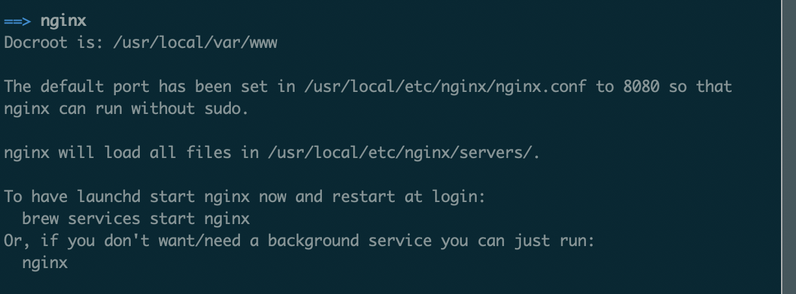

# 前端项目NGINX部署

## 安装NGINX
Mac上可以直接用homebrew来安装
```bash
brew install nginx
```
安装完后就是如下图所示：Docroot是NGINX服务器默认指向的资源路径，'/usr/local/etc/nginx/nginx.conf'是nginx的配置文件。


## nginx.conf配置
通常现在前端项目build后都会生成类似dist或build这样的目录，如果要想构建后文件夹能被nginx服务器识别，就需要修改nginx.conf这个配置文件。
大致修改如下：
```
server {
    listen       80;
    server_name  localhost;

    #charset koi8-r;

    #access_log  logs/host.access.log  main;

    # root 就是你build后的文件夹路径（下面是我电脑上一个项目的路径，直接pwd就可以查看了）
    location / {
      root   /Users/zyq/Documents/react-cnode/build;
      index  index.html index.htm;
    }
 }
```
然后nginx -s reload，重启nginx就OK了。

## NGINX代理
假如前端项目地址为localhost:8080，后端接口地址为localhost:3000，在部署后请求的接口会404，因为不在同一端口下是找不到对应的接口的，此时NGINX可以作为代理服务器来完成这一功能，一般为了区分前端资源，接口都会加个前缀以示区分，这里我举的例子就是以'api'为前缀，大致如下：
```
{  
  # 意思就是遇到/api的时候，就等价于请求了http://localhost:3000/api
  location /api {
    proxy_pass http://localhost:3000;
  }
}
```

## 路由是以history模式匹配
前端项目一般分为hash和history模式，当你路由以history时，本地是正常的，但是当你部署在NGINX后，你会发现只有首页正常，其他都是404，因为这种模式就跟浏览器一样，发现在请求时服务器根本没有这个路径，所以会404，这时候nginx就需要一些配置进行拦截，若果没找到就给他一个默认的文件地址，如下高亮部分：
```{3}
location / {
  root   /Users/zyq/Documents/vue-nginx/dist;
  try_files $uri $uri/ /index.html;
}
```
重启NGINX。

