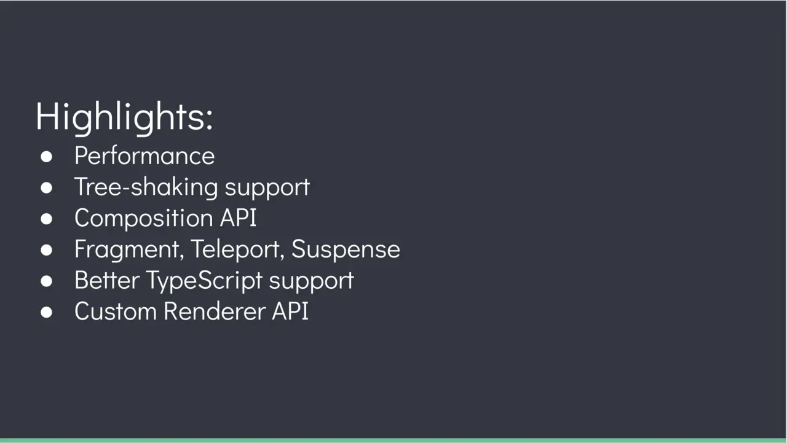
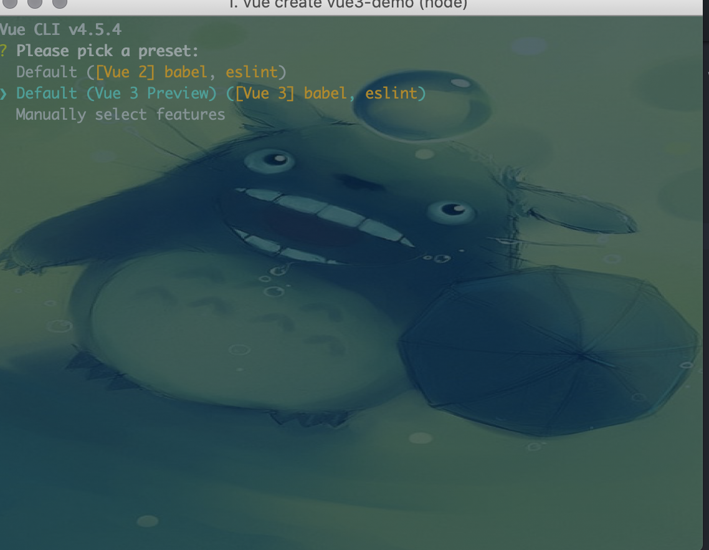

# vue3概览

为了躲懒，直接上图。



## 安装

为了体验 vue3.0 新特性，您的脚手架版本应该使用 Vue CLI v4.5，然后重新全局安装最新@vue/cli：

```bash
yarn global add @vue/cli@next
# OR
npm install -g @vue/cli@next
```

创建项目：

```bash
vue create vue3-demo
```

选择如图 Vue3.0 脚手架就安装 OK 了：


## Composition api

Why Composition api ?
官方是这么解释的。

> 创建 Vue 组件允许我们将接口的可重复部分及其功能提取到可重用的代码片段中。就可维护性和灵活性而言，仅这一点就可以让我们的应用程序走得很远。然而，我们的共同经验已经证明，仅凭这一点可能还不够，尤其是当应用程序变得非常庞大时——考虑到数百个组件。在处理如此大型的应用程序时，共享和重用代码变得尤为重要。

### setup

Composition API 的入口就是 setup 函数，携带两个参数。

1. props
2. context

#### props

setup 的 props 和 vue2 中 props 的概念是一样的。
props 是响应式的，如果用 es6 解构，响应式就失效了，这时候就需要用 toRefs 包一下。还有就是所有模板中需要的数据都需要在 return 中返回。

```vue
<!-- HelloWorld.vue -->

<template>
  <div>{{ customMsg }}</div>
</template>

<script>
import { toRefs } from 'vue'

export default {
  props: {
    msg: String
  },
  setup(props) {
    // 解构需要用toRefs包一下
    const { msg: customMsg } = toRefs(props)
    // setup中取值需要xxx.value，template可以直接访问
    console.log('customMsg', customMsg.value)
    // 所有模板中用到的数据都需要返回
    return {
      customMsg
    }
  }
}
</script>
```

#### context

这是 setup 的第二个参数，context 是一个暴露了三个参数的对象，且不是响应式的，所以可以安全的使用解构。

```vue
<template> </template>

<script>
export default {
  props: {
    msg: String
  },
  setup(props, { attrs, slots, emit }) {
    // Attributes (Non-reactive object)
    console.log(attrs)

    // Slots (Non-reactive object)
    console.log(slots)

    // Emit Events (Method)
    console.log(emit)
  }
}
</script>
```

### ref, reactive

在 vue2.x 版本中，都是用 data 来定义响应式数据，compistion api 中使用 ref 和 reactive 来定义响应式数据。
它们的区别是一个是定义基本类型数据，一个定义引用类型，还有就是ref包裹setup中需要xxx.value取值，reactive则不需要。

```vue
<template>
  <p>书本数量：{{ bookNum }}</p>
  <p>书本名：{{ book.title }}</p>
  <p>出版社：{{ book.press }}</p>
</template>

<script>
import { ref, reactive } from 'vue'

export default {
  setup() {
    const bookNum = ref(0)
    const book = reactive({
      title: 'vue入门教程',
      press: '人民出版社'
    })

    return {
      bookNum,
      book
    }
  }
}
</script>
```

### lifeCycle
以下是生命周期的对比，下面所有钩子都必须写在setup中。

| Options API     | Hook inside inside setup |
| --------------- | ------------------------ |
| beforeCreate    | Not needed*              |
|                 | setup                    |
| created         | Not needed*              |
| beforeMount     | onBeforeMount            |
| mounted         | onMounted                |
| beforeUpdate    | onBeforeUpdate           |
| updated         | onUpdated                |
| beforeUnmount   | onBeforeUnmount          |
| unmounted       | onUnmounted              |
| errorCaptured   | onErrorCaptured          |
| renderTracked   | onRenderTracked          |
| renderTriggered | onRenderTriggered        |


下面是几个常见的几个生命周期的例子：

```vue
<template>
  <p>书本数量：{{ bookNum }}</p>
  <p>书本名：{{ book.title }}</p>
  <p>出版社：{{ book.press }}</p>
</template>

<script>
import {
  ref,
  reactive,
  onBeforeMount,
  onMounted,
  onUpdated,
  onBeforeUnmount,
  onUnmounted
} from "vue";

export default {
  const bookNum = ref(0);
    const book = reactive({
      title: "vue入门教程",
      press: "人民出版社"
    });

    const handleClick = () => {
      bookNum.value++;
    };

    onBeforeMount(() => {
      console.log("onBeforeMount");
    });

    onMounted(() => {
      console.log("onMounted");
    });

    onUpdated(() => {
      console.log("onUpdated");
    });

    onBeforeUnmount(() => {
      console.log("onBeforeUnmount");
    });

    onUnmounted(() => {
      console.log("onUnmounted");
    });

    return {
      bookNum,
      book,
      handleClick
    };
}
</script>
```

### provide/inject

这个是我们通常用来祖先组件向子孙组件传递数据的，写法也改了。
```vue
<!-- MyMap.vue -->
<template>
  <my-marker></my-marker>
</template>

<script>
import { provide } from "vue";
import MyMarker from "./MyMarker.vue";

export default {
  components: {
    MyMarker
  },

  setup() {
    provide("location", "North Pole");
    provide("geolocation", {
      longitude: 90,
      latitude: 135
    });
    return {};
  }
};
</script>

```


```vue
<!-- MyMarker.vue -->
<template>
  <div>
    {{location}}
    {{geolocation}}
  </div>
</template>

<script>
import { inject } from "vue";

export default {
  setup() {
    const location = inject("location");
    const geolocation = inject("geolocation");

    return {
      location,
      geolocation
    };
  }
};
</script>
```

### Template Refs
其实就是Vue里面获取组件或者或者DOM节点的api，看例子。
原来是this.$refs[xxx]，Composition Api this没有了。
```vue
<template>
  <div ref="root">hello world</div>
</template>

<script>
import { ref, onMounted } from "vue";

export default {
  setup() {
    const root = ref(null);

    onMounted(() => {
      console.log("ref", root.value);
    });

    return { root };
  }
};
</script>
```


## Fragment,Teleport,Suspense

<Vssue />